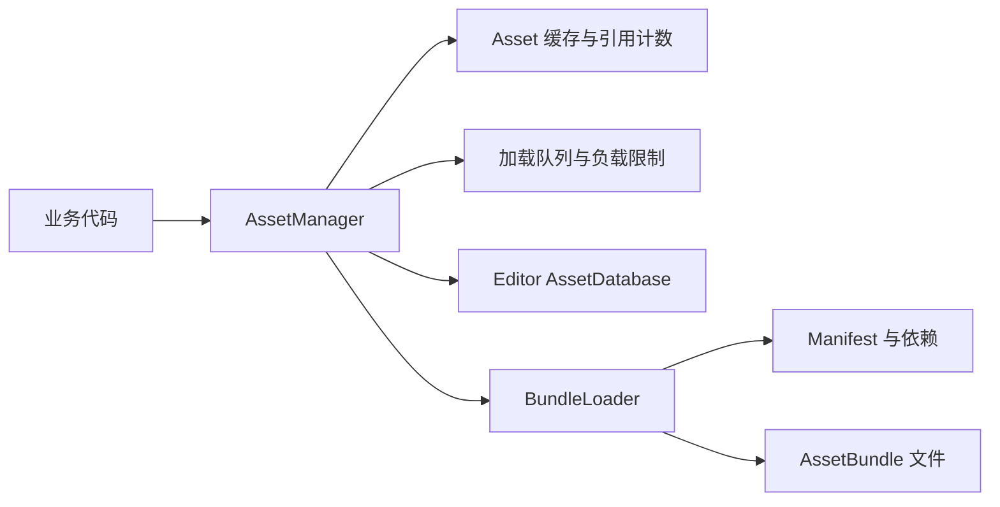

# AssetManager 资源管理模块

[返回首页](../README.md)

命名空间：

```csharp
using Sheng.GameFramework.Assets;
```

核心类型：`AssetManager`、`AssetHandle<T>`、`AssetInstanceHandle`、`AssetManagerSettings`、`AssetBundlePath`

## 模块结构



业务层只使用 `AssetManager`。`BundleLoader` 是包内底层实现，不对业务公开

## 加载模式

| 模式 | 行为 |
| --- | --- |
| `Auto` | Editor 使用 AssetDatabase，Player 使用 AssetBundle |
| `EditorDatabase` | Editor 按 AB 名称直接读取原始资源，Player 自动回退到 AssetBundle |
| `AssetBundle` | Editor 和 Player 都读取实际 AB 文件 |

`Auto` 是默认模式。开发阶段不必每次修改资源后重新打 AB，发布前切换到 `AssetBundle` 验证真实路径和分包

EditorDatabase 仍要求资源设置 AssetBundle 名称，因为框架通过 AB 名称定位资源

## 默认 AB 目录

```text
Application.streamingAssetsPath/AssetBundles/<Platform>
```

| 运行平台 | 目录和主 Manifest 名称 |
| --- | --- |
| Android | `Android` |
| iOS | `iOS` |
| Windows | `StandaloneWindows64` |
| macOS | `StandaloneOSX` |
| Linux | `StandaloneLinux64` |
| WebGL | `WebGL` |

构建输出位于：

```text
Assets/StreamingAssets/AssetBundles/<Platform>
```

构建方式见[构建模块](Build_Pipeline.md)

## 配置

配置必须发生在第一次加载之前：

```csharp
AssetManagerSettings settings = new AssetManagerSettings
{
    LoadMode = AssetLoadMode.Auto,
    DefaultCachePolicy = AssetCachePolicy.ReferenceCounted,
    MaxConcurrentLoads = 4,
    MaxLoadsPerFrame = 2,
    UnloadBundlesWhenUnused = true,
    EnableDebugLogs = false
};

AssetManager.Instance.Configure(settings);
```

自定义 AB 根目录和 Manifest 名称：

```csharp
AssetManager.Instance.Configure(
    settings,
    customBundleRoot,
    "StandaloneWindows64");
```

也可以只覆盖路径：

```csharp
AssetManager.Instance.ConfigureBundlePath(
    customBundleRoot,
    "StandaloneWindows64");
```

开始初始化、加载或缓存资源后再次配置会抛出 `InvalidOperationException`

## 初始化

```csharp
AssetManager.Instance.InitializeAsync(success =>
{
    if (!success)
    {
        Debug.LogError("资源系统初始化失败");
    }
});
```

EditorDatabase 模式直接初始化成功。AssetBundle 模式会异步加载主 Manifest

调用加载接口时会按需初始化，因此初始化不是强制步骤，但启动阶段显式初始化更容易统一处理失败

## 同步加载与释放

```csharp
AssetHandle<AudioClip> handle = AssetManager.Instance.LoadAsset<AudioClip>(
    "audio",
    "BattleMusic");

if (handle != null)
{
    audioSource.clip = handle.Asset;
}
```

使用完成后释放：

```csharp
handle?.Dispose();
handle = null;
```

每个句柄代表一次资源引用。`Dispose` 可重复调用，不会重复扣减

Android 和 WebGL 的 StreamingAssets 不支持同步 AB 加载，真机业务应优先使用异步接口

## 异步加载与释放

```csharp
AssetManager.Instance.LoadAssetAsync<GameObject>(
    "characters",
    "Player",
    handle =>
    {
        if (handle == null)
        {
            return;
        }

        try
        {
            GameObject instance = Object.Instantiate(handle.Asset);
        }
        finally
        {
            handle.Dispose();
        }
    });
```

相同资源的并发请求会合并。全部回调收到独立句柄，但句柄指向同一个缓存资源

异步接口要求提供回调，因为资源句柄必须有明确接收方

## 实例句柄

预制体推荐直接使用实例化接口：

```csharp
AssetInstanceHandle enemyHandle;

AssetManager.Instance.InstantiateAsync(
    "characters",
    "Enemy",
    handle =>
    {
        enemyHandle = handle;
        if (enemyHandle != null)
        {
            enemyHandle.Instance.transform.position = spawnPosition;
        }
    });
```

销毁实例并释放预制体引用：

```csharp
enemyHandle?.Dispose();
enemyHandle = null;
```

实例要交给对象池继续管理时，可以保留实例，只释放句柄所有权：

```csharp
enemyHandle?.Release(destroyInstance: false);
```

此时业务层负责实例后续销毁

## 引用计数

资源第一次加载时创建缓存条目，并为该缓存保留主 Bundle 和全部依赖 Bundle

```text
LoadAsset -> Asset 引用 +1
再次加载 -> Asset 引用 +1
Dispose -> Asset 引用 -1
Asset 引用归零 -> 移除资源缓存 -> 主包和依赖包引用 -1
Bundle 引用归零 -> 自动 Unload(false)
```

共享依赖按缓存条目计数。例如两个资源都依赖 `common`，释放其中一个不会提前卸载 `common`

查询引用：

```csharp
int assetRefs = AssetManager.Instance.GetAssetReferenceCount<Texture2D>(
    "ui",
    "Icon");

int bundleRefs = AssetManager.Instance.GetBundleReferenceCount("ui");
```

## 缓存策略

| 策略 | 行为 |
| --- | --- |
| `ReferenceCounted` | 引用归零后立即移除缓存并释放 Bundle 引用 |
| `KeepLoaded` | 引用归零后继续缓存，直到显式清理或全部卸载 |

指定单次加载策略：

```csharp
AssetManager.Instance.LoadAssetAsync<Texture2D>(
    "ui",
    "CommonIcon",
    handle => { },
    AssetCachePolicy.KeepLoaded);
```

同一资源只要有一次请求使用 `KeepLoaded`，本次缓存生命周期就会升级为常驻，不会被后续请求降级

清理零引用常驻缓存：

```csharp
int assetCount = AssetManager.Instance.ClearUnusedAssets(
    includeKeepLoaded: true);
```

## 负载限制

`MaxConcurrentLoads` 限制同时进行的顶层资源请求数量，`MaxLoadsPerFrame` 限制 Play Mode 每帧启动的新请求数量

这两个参数用于削平集中加载造成的主线程和 IO 峰值。它们不改变单个 AssetBundleRequest 的内部耗时，也不等同于完整的下载带宽控制

## 卸载接口

卸载没有资源引用的 Bundle：

```csharp
AssetManager.Instance.UnloadUnusedBundles();
```

卸载指定零引用 Bundle：

```csharp
bool unloaded = AssetManager.Instance.UnloadBundle("ui");
```

Bundle 仍被资源缓存引用时，`UnloadBundle` 会拒绝操作，避免产生悬空资源

释放零引用缓存、卸载 Bundle，并请求 Unity 回收无引用资源内存：

```csharp
AssetManager.Instance.UnloadUnusedAssetsAsync(() =>
{
    Debug.Log("资源清理完成");
});
```

清空全部缓存和 AB：

```csharp
AssetManager.Instance.UnloadAll(false);
```

`false` 使用 `AssetBundle.Unload(false)`，仍被场景、组件或实例引用的 Unity Object 不会被强制销毁

## 调试

Play Mode 中选中自动创建的 `[AssetManager]` 对象，Inspector 会显示：

- 当前实际加载模式
- 已缓存 Asset、类型、引用计数和缓存策略
- 已加载 Bundle 和引用计数
- 活动请求和排队请求数量
- 清理零引用资源与卸载全部按钮

代码读取快照：

```csharp
AssetManagerDebugSnapshot snapshot =
    AssetManager.Instance.GetDebugSnapshot();
```

`EnableDebugLogs` 开启后会输出缓存创建、复用、释放和移除日志，正式包建议关闭

## 公开 API

| API | 用途 |
| --- | --- |
| `Configure` | 设置加载模式、缓存和负载参数 |
| `ConfigureBundlePath` | 覆盖 AB 根目录和 Manifest 名称 |
| `InitializeAsync` | 初始化资源系统 |
| `LoadAsset<T>` | 同步加载并返回资源句柄 |
| `LoadAssetAsync<T>` | 异步加载并返回资源句柄 |
| `InstantiateAsync` | 实例化预制体并返回实例句柄 |
| `Release` | 释放任意资源句柄 |
| `ClearUnusedAssets` | 清理零引用 Asset 缓存 |
| `UnloadUnusedBundles` | 卸载零引用 Bundle |
| `UnloadBundle` | 卸载指定零引用 Bundle |
| `UnloadUnusedAssetsAsync` | 请求完整的无引用资源内存清理 |
| `UnloadAll` | 清空资源和 Bundle 缓存 |
| `GetDebugSnapshot` | 获取运行状态 |

## 当前限制

- 远程下载、版本对比、Hash 校验、断点续传和热更新尚未实现
- 限流针对资源请求数量，不包含网络带宽和字节级 IO 预算
- EditorDatabase 依赖正确的 AB 标签，同一 Bundle 内同名资源需要传 `Assets/...` 完整路径
- `PoolManager` 会为资源池持有一个预制体句柄，并在删池完成时释放，详见[对象池模块](PoolManager.md)
