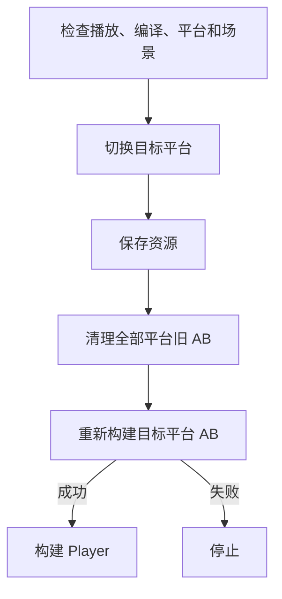

# 构建模块

[返回首页](../README.md)

命名空间：

```csharp
using Sheng.GameFramework.Editor;
```

该模块只在 Unity Editor 中可用，不会进入 Player

## 构建窗口

打开：

```text
Sheng Game Framework > Build > 多平台构建工具
```

窗口提供：

- 当前编辑器平台 AB
- Android AB
- Windows PC AB
- Android APK 或 AAB 完整包
- Windows PC EXE 完整包
- 输出目录快捷入口
- Development Build 开关

## 菜单快捷入口

```text
Sheng Game Framework > Build > AssetBundles > 当前编辑器
Sheng Game Framework > Build > AssetBundles > Android
Sheng Game Framework > Build > AssetBundles > Windows PC
Sheng Game Framework > Build > 完整包 > Android
Sheng Game Framework > Build > 完整包 > Windows PC
```

当前激活平台还有一组简化入口：

```text
Sheng Game Framework > AssetBundles > Build Active Target
Sheng Game Framework > AssetBundles > Open Output Folder
```

## 构建前配置

### 场景

完整包只包含 `File > Build Settings` 中已添加并启用的场景。没有启用场景时完整包会停止

### AssetBundle

在资源 Inspector 中设置 AB 名称。可以使用官方 Asset Bundle Browser 检查：

```text
Sheng Game Framework > AssetBundles > Open Asset Bundle Browser
```

框架载入时会尝试安装官方 Asset Bundle Browser `1.7.0`。自动安装失败时可以选择：

```text
Sheng Game Framework > AssetBundles > Install Asset Bundle Browser
```

### 平台模块

Android 或 Windows 构建支持缺失时，使用 Unity Hub 为当前 Unity 版本添加对应 Build Support

## 仅构建 AB

仅 AB 流程：

1. 检查目标平台模块
2. 清理目标平台旧输出
3. 使用 `ChunkBasedCompression` 构建全部 AB
4. 刷新 AssetDatabase

当前没有任何资源设置 AB 名称时，流程按合法空构建完成，不会报失败

## 构建完整包

完整包流程：



完整包一定会重新打目标平台 AB。AB 失败时不会继续生成 Player

构建前会清理 `Assets/StreamingAssets/AssetBundles` 下所有平台的旧输出，防止 Android 包中混入 Windows 或编辑器 AB

## Android APK 和 AAB

在多平台构建窗口中勾选 `Android 使用 AAB`：

- 未勾选：输出 `.apk`
- 已勾选：输出 `.aab`

框架使用项目当前 Player Settings，不会自动填写包名、签名、最低系统版本或图标。这些内容需要在 `Project Settings > Player` 中配置

## 输出目录

AB：

```text
Assets/StreamingAssets/AssetBundles/Android
Assets/StreamingAssets/AssetBundles/StandaloneWindows64
Assets/StreamingAssets/AssetBundles/StandaloneOSX
```

完整包：

```text
Builds/Android/<ProductName>.apk
Builds/Android/<ProductName>.aab
Builds/Windows64/<ProductName>.exe
```

`ProductName` 来自 Player Settings，非法文件名字符会替换为下划线

## 编辑器脚本 API

```csharp
bool editorAB = GameBuildPipeline.BuildEditorAssetBundles();
bool androidAB = GameBuildPipeline.BuildAndroidAssetBundles();
bool windowsAB = GameBuildPipeline.BuildWindowsAssetBundles();

bool androidPlayer = GameBuildPipeline.BuildAndroidPackage(developmentBuild: true);
bool windowsPlayer = GameBuildPipeline.BuildWindowsPackage(developmentBuild: false);
```

通用接口：

```csharp
GameBuildPipeline.BuildAssetBundles(target, cleanOutput: true);
GameBuildPipeline.BuildCompletePackage(target, developmentBuild: false);
```

这些 API 只能放在 Editor 程序集或 `Editor` 目录中调用

## AI 自动化构建

UnityAgentBridge 提供异步构建命令，可以在 Unity 保持打开时由终端或 AI 调用。具体命令见 [UnityAgentBridge](UnityAgentBridge.md)

## 当前限制

- 完整包快捷入口只覆盖 Android 和 Windows PC
- 当前不处理签名、渠道包、版本号自增和上传商店
- 当前不生成远程 AB 版本清单或补丁包
- Android 和 Windows 完整包入口需要在对应平台环境实际验收
