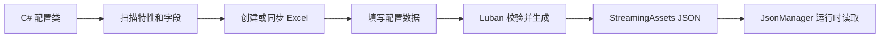

# Luban 配置工具

[返回首页](../README.md)

框架提供 Code First 的 Luban 工作流：先编写 C# 配置类，再生成或同步 Excel，最后由 Luban 生成 JSON



工具不提供 Luban 反向生成 C# 类。C# 是结构来源，Excel 是数据来源

## 环境要求

- Unity `2022.3` 或兼容版本
- .NET 8 或可向前兼容运行 Luban 的更高版本
- 首次安装 Luban 时需要网络

工具固定使用 Luban `4.10.2`，下载后校验 SHA-256，并安装到：

```text
Library/ShengGameFramework/Tools/Luban/4.10.2/Luban
```

`Library` 不提交 Git，也不会进入 Player

配置目录和 JSON 输出目录必须位于 Unity 项目内，工具会拒绝绝对路径和包含 `..` 的目录

## 打开工具

Unity 顶部菜单：

```text
Sheng Game Framework > Data > Luban 配置工具
```

## 第一个配置类

```csharp
using System.Collections.Generic;
using Sheng.GameFramework.Config;

public enum WeaponQuality
{
    Normal,
    Rare,
    Epic
}

[LubanTable("weapon", Comment = "武器配置")]
public sealed class WeaponConfig
{
    [LubanKey]
    [LubanColumn(Comment = "武器编号")]
    public int Id;

    [LubanColumn(Comment = "显示名称")]
    public string Name;

    public WeaponQuality Quality;

    [LubanColumn(DefaultValue = "10")]
    public int Damage;

    [LubanColumn(Separator = ",")]
    public List<int> UpgradeCosts;

    [LubanIgnore]
    public string RuntimeCache;
}
```

配置类必须满足：

- 普通非抽象 C# 类
- 不能继承 `MonoBehaviour` 或 `ScriptableObject`
- 字段为公开实例字段，或公开可读写属性
- 每张表必须且只能有一个 `[LubanKey]`
- 表名和 JSON 输出名不能重复

## 支持的字段类型

| C# 类型 | Luban 类型 |
| --- | --- |
| `bool` | `bool` |
| 整数类型 | 对应整数类型 |
| `float`、`double` | 对应浮点类型 |
| `string` | `string` |
| `enum` | `string` |
| `Nullable<T>` | `T?` |
| `T[]` | `list<T>` |
| `List<T>` | `list<T>` |
| `IList<T>` | `list<T>` |
| `IReadOnlyList<T>` | `list<T>` |

集合当前只支持标量或枚举元素，不支持字典、嵌套集合和自定义对象

## 配置特性

### LubanTable

| 参数 | 用途 | 默认值 |
| --- | --- | --- |
| 构造参数 `tableName` | 表名和 Excel 文件名 | 必填 |
| `OutputName` | JSON 文件名，不含扩展名 | `tb<tableName>` |
| `Group` | Luban 分组 | `c` |
| `Comment` | 表说明 | 空 |

### LubanColumn

| 参数 | 用途 | 默认值 |
| --- | --- | --- |
| 构造参数 `name` | Excel 和 JSON 列名 | C# 成员名首字母小写 |
| `DefaultValue` | 新增字段时填入旧数据行的值 | 空 |
| `Comment` | Excel 列说明 | 空 |
| `Required` | 工具校验时是否允许空值 | `true` |
| `FormerName` | 字段改名前的旧列名 | 空 |
| `Separator` | 集合单元格分隔符 | `,` |

`[LubanIgnore]` 用于排除不需要进入配置表的运行时字段

## 标准操作流程

1. 编写带 `[LubanTable]` 的 C# 配置类
2. 等待 Unity 编译完成
3. 打开 Luban 配置工具
4. 首次使用点击 `安装 Luban`
5. 点击 `从 C# 创建或同步表`
6. 点击 `打开表文件夹` 并填写 Excel 数据
7. 点击 `校验 Luban 表`
8. 点击 `Luban 表转 JSON`
9. 在运行时通过 `JsonManager.LoadLubanTableAsync<T>` 读取

`初始化配置目录` 会创建 Luban 项目文件和 `__tables__.xlsx`，同步表时也会自动初始化

## 字段发生变化

### 新增字段

```csharp
[LubanColumn(DefaultValue = "100")]
public int MaxHealth;
```

再次点击 `从 C# 创建或同步表`。工具会增加新列，保留原有行数据，并用 `DefaultValue` 填充旧数据行

### 字段改名

```csharp
[LubanColumn("displayName", FormerName = "name")]
public string DisplayName;
```

同步时旧 `name` 列的数据会迁移到 `displayName`，不会触发删除确认。确认所有分支和旧表都已经迁移后，可以在后续版本移除 `FormerName`

### 删除字段

从 C# 类删除成员后，同步工具会列出待删除列并要求二次确认。确认后会先备份原 Excel，再写入新结构

备份目录：

```text
Library/ShengGameFramework/LubanBackups
```

多张表会先整体预检查，只要存在未确认的删除或损坏表，就不会提前修改其他表

## 目录结构

```text
Config/Luban/
├── luban.conf
├── Defines/
│   └── builtin.xml
└── Datas/
    ├── __tables__.xlsx
    ├── #weapon.xlsx
    └── #enemy.xlsx

Assets/StreamingAssets/Config/Luban/
├── tbweapon.json
├── tbenemy.json
└── luban_manifest.json
```

`Config/Luban` 中的 Excel 和配置文件应提交 Git。`StreamingAssets` 中的正式 JSON 是否提交由项目发布流程决定，但同一项目应保持一致

生成前先写入 `Library/ShengGameFramework/LubanOutput`，解析全部 JSON 成功后才发布到正式目录

## 生成清单

`luban_manifest.json` 记录：

- Luban 版本
- C# 表结构哈希
- UTC 生成时间
- 每个 JSON 的文件名、大小和 SHA-256

它可以用于排查配置是否漏生成或不同机器输出是否一致

## 表数据校验

工具在调用 Luban 前检查：

- C# 类型和字段是否受支持
- 是否存在且仅存在一个主键
- Excel 是否缺列或残留旧列
- Excel 类型行是否与 C# 一致
- 必填字段是否为空
- 标量枚举值是否有效
- 主键是否重复

真实 Luban 还会执行自己的完整解析和数据校验

## UnityAgentBridge 命令

| 命令 | 作用 |
| --- | --- |
| `GetLubanStatus` | 查询 dotnet、Luban、目录和配置类扫描状态 |
| `StartLubanInstallation` | 安装并校验固定版本 Luban |
| `ValidateLubanProject` | 同步前检查 C# 和 Excel 结构 |
| `StartLubanValidation` | 使用真实 Luban 校验全部表 |
| `StartLubanJsonGeneration` | 使用真实 Luban 生成正式 JSON |
| `GetTaskStatus` | 查询安装、校验或生成任务状态 |

启动异步任务后，持续调用 `GetTaskStatus`，直到状态不再是 `Queued` 或 `Running`

## 常见问题

### 扫描不到配置类

确认业务程序集引用 `Sheng.GameFramework.Runtime`，类已成功编译并添加 `[LubanTable]`

测试程序集中的配置类会被项目扫描自动排除，不会生成测试表

### 找不到 dotnet

安装 .NET 8，或在工具的 `dotnet 自定义路径` 中填写可执行文件绝对路径

### 修改 C# 字段后生成失败

先执行 `从 C# 创建或同步表`，再校验和生成。只改类而不更新 Excel 时，结构校验会阻止输出

### JSON 没有更新

确认最后执行的是 `Luban 表转 JSON`，并检查日志和 `luban_manifest.json` 的生成时间
