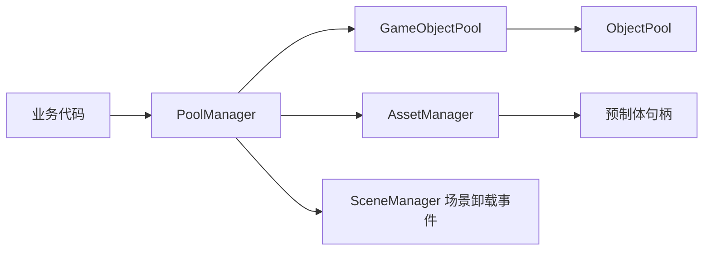

# PoolManager 对象池模块

[返回首页](../README.md)

命名空间：

```csharp
using Sheng.GameFramework.Pooling;
```

核心类型：`ObjectPool<T>`、`PoolManager`、`PoolKey`、`GameObjectPoolOptions`、`PooledHandle`、`IPoolable`

## 模块结构



`ObjectPool<T>` 不依赖 Unity 对象，负责创建、容量、LIFO 复用和销毁回调

`PoolManager` 是跨场景单例，负责预制体加载、GameObject 状态重置、延迟归还、场景生命周期和调试信息

## 泛型对象池

```csharp
ObjectPool<BulletData> pool = new ObjectPool<BulletData>(
    create: () => new BulletData(),
    initialCapacity: 16,
    maxCapacity: 64,
    onRent: data => data.Reset(),
    onDestroy: data => data.Dispose());

BulletData bullet = pool.Rent();
if (bullet != null)
{
    pool.Return(bullet);
}
```

也可以用租约自动归还：

```csharp
using (PoolLease<BulletData> lease = pool.RentLease())
{
    lease.Item.Simulate();
}
```

泛型池规则：

- `maxCapacity = -1` 表示无上限
- 最大容量必须大于 `0` 或等于 `-1`
- 有上限且所有对象都在使用时，`Rent` 返回 `null`
- 达到上限时不会抢占仍在使用的对象
- 默认开启归还检查，重复归还或归还外部对象会抛出异常
- 空闲对象按 LIFO 顺序复用

## 初始化 GameObject 池

GameObject 池必须先初始化，再执行租用

直接使用已有预制体：

```csharp
PoolKey bulletPool = PoolKey.FromName("Bullet");

bool initialized = PoolManager.Instance.InitializePool(
    bulletPool,
    bulletPrefab,
    initialCapacity: 24,
    maxCapacity: 80,
    lifetime: PoolLifetime.Scene);
```

完整配置：

```csharp
GameObjectPoolOptions options = new GameObjectPoolOptions
{
    InitialCapacity = 24,
    MaxCapacity = 80,
    PrewarmPerFrame = 4,
    Lifetime = PoolLifetime.Scene,
    ResetTransform = true,
    ResetPhysics = true,
    StopEffectsOnReturn = true,
    CollectionChecks = true
};

PoolManager.Instance.InitializePool(
    PoolKey.FromName("Bullet"),
    bulletPrefab,
    options);
```

| 配置 | 默认值 | 作用 |
| --- | ---: | --- |
| `InitialCapacity` | `0` | 初始化时预热的对象数量 |
| `MaxCapacity` | `-1` | 池内活动和空闲对象总上限，`-1` 为无限 |
| `PrewarmPerFrame` | `4` | Play Mode 异步预热每帧创建数量 |
| `Lifetime` | `Scene` | 场景卸载时删除或跨场景保留 |
| `ResetTransform` | `true` | 租用和归还时重置 Transform |
| `ResetPhysics` | `true` | 清空 Rigidbody 和 Rigidbody2D 速度 |
| `StopEffectsOnReturn` | `true` | 停止粒子并清理 TrailRenderer |
| `CollectionChecks` | `true` | 检查重复归还和错误归还 |

初始化容量不能超过有上限的最大容量

## 从 AssetManager 初始化

```csharp
PoolKey explosionPool = PoolManager.Instance.InitializePoolAsync(
    "effects",
    "Explosion",
    initialCapacity: 8,
    maxCapacity: 32,
    lifetime: PoolLifetime.Persistent,
    completed: success =>
    {
        Debug.Log($"Explosion pool ready: {success}");
    });
```

相同 Key、资源和配置的并发初始化会合并，全部调用方会收到结果。相同 Key 使用不同资源或配置会失败

资源池在整个注册期间持有一个 `AssetHandle<GameObject>`：

```text
InitializePoolAsync -> Asset 引用 +1
ClearPool -> 引用保持
DeletePool 完成 -> Asset 引用 -1
```

## 租用与归还

句柄方式适合明确控制生命周期：

```csharp
PooledHandle handle = PoolManager.Instance.Rent(
    bulletPool,
    muzzle.position,
    muzzle.rotation);

if (handle != null)
{
    Bullet bullet = handle.Get<Bullet>();
    bullet.Fire();
    handle.Dispose();
}
```

组件方式更接近日常业务调用：

```csharp
Bullet bullet = PoolManager.Instance.Rent<Bullet>(
    bulletPool,
    muzzle.position,
    muzzle.rotation);

if (bullet != null)
{
    PoolManager.Instance.Return(bullet);
}
```

归还只需要对象或组件，不需要再次传入 Key。每个实例上的 `PooledObject` 会保存所属池

延迟归还：

```csharp
PoolManager.Instance.ReturnAfter(bullet, 2f);
```

延迟归还会记录本次租用版本。如果对象提前归还后又被重新租出，旧计时器不会误归还新一轮对象

达到最大容量时，`Rent` 返回 `null`，不会销毁或抢占活动对象。业务应处理失败，例如跳过非关键特效

## 生命周期回调

需要在复用时重置业务状态的组件实现 `IPoolable`：

```csharp
public sealed class Bullet : MonoBehaviour, IPoolable
{
    public void OnPoolCreated()
    {
    }

    public void OnRentFromPool()
    {
        damage = baseDamage;
    }

    public void OnReturnToPool()
    {
        target = null;
    }

    public void OnPoolDestroyed()
    {
    }
}
```

| 回调 | 时机 |
| --- | --- |
| `OnPoolCreated` | 实例第一次创建并接入池时 |
| `OnRentFromPool` | 每次租用并激活后 |
| `OnReturnToPool` | 每次进入空闲状态前，预热创建后也会调用 |
| `OnPoolDestroyed` | 池销毁该实例前 |

运行时新增实现 `IPoolable` 的子组件后，调用实例上 `PooledObject.RefreshCallbacks()` 刷新缓存

## 清理与删除

```csharp
PoolManager.Instance.ClearPool(bulletPool);
PoolManager.Instance.DeletePool(bulletPool, force: false);
PoolManager.Instance.DeletePool(bulletPool, force: true);
```

| 操作 | 空闲对象 | 活动对象 | 池注册 | Asset 句柄 |
| --- | --- | --- | --- | --- |
| `ClearPool` | 立即销毁 | 保留 | 保留 | 保留 |
| `DeletePool(force: false)` | 立即销毁 | 等待归还后销毁 | 最后移除 | 最后释放 |
| `DeletePool(force: true)` | 立即销毁 | 立即销毁 | 立即移除 | 立即释放 |

安全删除开始后池进入 `Disposing`，不再接受新租用。适合正常业务退出

强制删除可能让业务保存的组件或句柄立即失效，适合场景卸载、退出游戏和异常恢复

## 场景生命周期

| 生命周期 | 行为 |
| --- | --- |
| `PoolLifetime.Scene` | 记录初始化时的 `Scene.handle`，该场景卸载时强制删除 |
| `PoolLifetime.Persistent` | 场景切换时保留，直到显式删除 |

手动批量删除：

```csharp
PoolManager.Instance.DeleteScenePools(scene);
PoolManager.Instance.DeletePersistentPools();
PoolManager.Instance.DeleteAllPools(force: false);
```

## 批量初始化

```csharp
PoolDefinition[] definitions =
{
    PoolDefinition.FromPrefab("Bullet", bulletPrefab, 24, 80),
    PoolDefinition.FromAsset("effects", "Explosion", 8, 32)
};

PoolManager.Instance.InitializePoolsAsync(
    definitions,
    success => Debug.Log($"Pools ready: {success}"));
```

批量结果只有在全部定义初始化成功时才为 `true`

## 调试

运行时选中自动创建的 `[PoolManager]` 对象，Inspector 会显示：

- 初始化中的池数量
- Key、状态、生命周期、来源和所属场景
- 总对象、活动对象、空闲对象和最大容量
- 单池清空、安全删除和强制删除按钮
- 全部池的清空与删除按钮

代码读取快照：

```csharp
PoolManagerDebugSnapshot snapshot =
    PoolManager.Instance.GetDebugSnapshot();
```

## 公开 API

| API | 用途 |
| --- | --- |
| `InitializePool` | 使用已有预制体同步初始化 |
| `InitializePoolAsync` | 通过 AssetManager 异步初始化 |
| `InitializePoolsAsync` | 批量初始化多个池 |
| `Rent` / `Rent<T>` | 租用句柄或组件 |
| `TryRent` / `TryRent<T>` | 尝试租用并返回成功状态 |
| `Return` | 通过 GameObject 或组件归还 |
| `ReturnAfter` | 延迟归还并保护租用版本 |
| `PrewarmPool` / `PrewarmPoolAsync` | 为已就绪池增加空闲对象 |
| `SetMaxCapacity` | 动态调整最大容量 |
| `ClearPool` / `ClearAllPools` | 销毁空闲对象并保留注册 |
| `DeletePool` / `DeleteAllPools` | 删除池并释放资源句柄 |
| `DeleteScenePools` | 删除指定场景拥有的场景池 |
| `DeletePersistentPools` | 删除全部常驻池 |
| `GetDebugSnapshot` | 获取运行状态 |

## 当前限制

- GameObject 池只在 Unity 主线程使用，不提供线程安全保证
- 池不自动推断业务对象应何时归还，生命周期由业务层或 `ReturnAfter` 决定
- `ResetTransform` 和 `ResetPhysics` 只处理通用状态，Animator、计时器和业务字段应通过 `IPoolable` 重置
- 场景池按初始化时的活动场景归属，不会跟随租用对象的父节点改变归属
