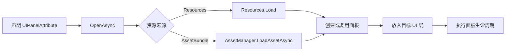

# UI 模块

[返回首页](../README.md)

命名空间：

```csharp
using Sheng.GameFramework.UI;
```

核心类型：`UIManager`、`UIPanel`、`UIPanelAttribute`、`UILayer`、`SafeAreaAdapter`

## 工作流程



## 创建第一个面板

### 1. 编写面板类

Resources 版本：

```csharp
using Sheng.GameFramework.UI;

[UIPanelAttribute(
    "UI/HomePanel",
    AssetSource = UIAssetSource.Resources,
    Layer = UILayer.Normal,
    UseSafeArea = true,
    CacheOnClose = true)]
public sealed class HomePanel : UIPanel
{
    protected override void OnOpened(object userData)
    {
    }

    public void OnCloseButtonClicked()
    {
        CloseSelf();
    }
}
```

对应预制体路径：

```text
Assets/Resources/UI/HomePanel.prefab
```

AssetBundle 版本：

```csharp
[UIPanelAttribute(
    "HomePanel",
    BundleName = "ui",
    AssetSource = UIAssetSource.AssetBundle,
    Layer = UILayer.Normal)]
public sealed class HomePanel : UIPanel
{
}
```

对应预制体需要设置 AB 名称 `ui`

### 2. 配置预制体

- 根节点必须是 `RectTransform`
- 根节点挂载对应的 `UIPanel` 子类
- `CanvasGroup` 可以预先添加，也可以由框架自动补充
- 面板内部按钮、图片和文本按普通 uGUI 方式配置

### 3. 打开和关闭

```csharp
UIManager.Instance.OpenAsync<HomePanel>(panel =>
{
    if (panel == null)
    {
        Debug.LogError("HomePanel 打开失败");
    }
}, userData);
```

```csharp
UIManager.Instance.Close<HomePanel>();
UIManager.Instance.Close<HomePanel>(destroy: true);
```

`destroy: false` 会按照 `CacheOnClose` 决定是否缓存。`destroy: true` 会销毁已打开或已缓存的面板

## 面板配置

| 属性 | 默认值 | 说明 |
| --- | --- | --- |
| `AssetName` | 面板类型名 | Resources 路径或 AB 内资源名 |
| `BundleName` | `ui` | AB 名称 |
| `AssetSource` | `AssetBundle` | `AssetBundle` 或 `Resources` |
| `Layer` | `Normal` | 面板所在层 |
| `UseSafeArea` | `true` | 是否应用屏幕安全区 |
| `Modal` | `false` | 是否创建模态遮罩 |
| `CloseOnMaskClick` | `false` | 点击遮罩是否关闭面板 |
| `CacheOnClose` | `true` | 关闭后是否缓存实例 |
| `MaskAlpha` | `0.55` | 遮罩黑色透明度 |

没有声明 `UIPanelAttribute` 时，框架使用面板类型名作为 `AssetName`，并采用表中的默认值

## UI 层级

| 层 | Sorting Order | 用途 |
| --- | ---: | --- |
| `Background` | 0 | UI 背景 |
| `HUD` | 100 | 战斗 HUD |
| `Touch` | 200 | 移动、射击等触摸操作 |
| `Normal` | 300 | 普通页面 |
| `Popup` | 500 | 弹窗和选择面板 |
| `Tip` | 700 | Tip、飘字和提示 |
| `System` | 900 | 加载、断线等系统级界面 |

每层拥有独立 Canvas 和 GraphicRaycaster。模态遮罩创建在面板同一层并位于面板后方，因此会阻挡该层中位于它后面的 UI，但不会阻挡更高 Sorting Order 的层

## 模态面板

```csharp
[UIPanelAttribute(
    "ConfirmPanel",
    BundleName = "ui",
    Layer = UILayer.Popup,
    Modal = true,
    CloseOnMaskClick = true,
    MaskAlpha = 0.6f)]
public sealed class ConfirmPanel : UIPanel
{
}
```

遮罩使用全屏 `Image` 接收射线。即使 `CloseOnMaskClick` 为 `false`，遮罩仍会阻止点击穿透，只是不执行关闭

## 生命周期

| 回调 | 调用时机 |
| --- | --- |
| `OnCreated` | 面板实例第一次初始化，仅调用一次 |
| `OnOpened` | 每次打开或从缓存恢复时调用 |
| `OnClosed` | 每次正常关闭时调用 |
| `OnBroughtToFront` | 打开完成或重复打开已显示面板时调用 |

```csharp
protected override void OnOpened(object userData)
{
    if (userData is PlayerProfile profile)
    {
        Refresh(profile);
    }
}
```

同一面板类型同时只维护一个打开实例。相同类型的并发加载请求会合并，但第一条请求的 `userData` 用于本次打开，所有回调会收到同一个结果

## 查询和批量关闭

```csharp
bool isOpen = UIManager.Instance.IsOpen<HomePanel>();
HomePanel panel = UIManager.Instance.Get<HomePanel>();

UIManager.Instance.CloseAll();
UIManager.Instance.CloseAll(destroy: true);
```

获取层根节点：

```csharp
RectTransform tipRoot = UIManager.Instance.GetLayerRoot(UILayer.Tip);
```

## Safe Area

`UseSafeArea = true` 时，框架会自动添加或启用 `SafeAreaAdapter`，根据 `Screen.safeArea` 更新面板根节点锚点。屏幕尺寸、方向或安全区变化时会重新计算

如果只希望部分内容避开刘海和圆角，建议让面板根节点使用安全区，再把允许铺满屏幕的背景放到独立 `Background` 面板

## EventSystem 和输入模块

UIManager 会保留一个主 EventSystem、禁用重复 EventSystem，并在旧输入系统启用时补充 `StandaloneInputModule`

如果项目只使用新 Input System，框架当前不会自动创建 `InputSystemUIInputModule`，需要业务项目安装 Input System 并自行配置 UI Input Module

## 当前限制

- 基于 uGUI，不包含 UI Toolkit 面板管理
- 面板按类型唯一，不支持同类型多实例弹窗
- 不包含页面历史栈、返回键路由和动画编排
- AB 面板依赖 `AssetManager`，UIManager 会在实例化预制体后自动释放资源句柄
