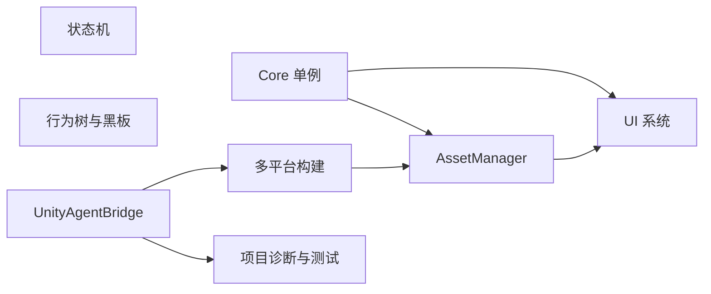

# Sheng Game Framework

Sheng Game Framework 是一个面向 Unity 项目的轻量基础框架，当前提供单例、AssetBundle、UI、状态机、行为树、多平台构建以及 UnityAgentBridge 自动化能力

> 当前版本：`0.1.0`
>
> Unity 版本：`2022.3.62f3c1`
>
> 运行时命名空间：`Sheng.GameFramework.*`

## 功能概览

| 模块 | 能力 | 可用范围 |
| --- | --- | --- |
| Core | 普通 C# 单例、场景单例、跨场景单例 | Runtime |
| AssetManager | Asset/Bundle 加载、引用计数、缓存、限流和卸载 | Runtime |
| UI | 七层 Canvas、面板缓存、模态遮罩、安全区 | Runtime |
| StateMachine | 泛型状态、切换守卫、外部逻辑帧驱动 | Runtime |
| BehaviorTree | 组合节点、装饰节点、类型安全黑板 | Runtime |
| Build Pipeline | 编辑器、Android、Windows AB 与完整包 | Editor |
| UnityAgentBridge | 编译检查、诊断、测试、截图和构建命令 | Editor |



## 快速开始

1. 使用 Unity Hub 打开 `ShengGameFrame/`
2. 等待 Package Manager 和脚本编译完成
3. 打开 `Window > General > Test Runner`，运行 EditMode 测试
4. 从 `Sheng Game Framework` 菜单使用 AB、构建和可视化工具

将框架接入其他 Unity 项目时，请参阅[安装与快速开始](Docs/Getting_Started.md)

## 文档导航

| 文档 | 内容 |
| --- | --- |
| [安装与快速开始](Docs/Getting_Started.md) | 安装、依赖、程序集引用和首次验证 |
| [单例模块](Docs/Singletons.md) | 三种单例的选择与生命周期 |
| [AssetManager 模块](Docs/AssetManager.md) | 资源句柄、引用计数、缓存、限流与卸载 |
| [UI 模块](Docs/UI_System.md) | 面板声明、分层、模态和安全区 |
| [状态机模块](Docs/StateMachine.md) | 状态定义、切换和逻辑帧驱动 |
| [行为树模块](Docs/BehaviorTree.md) | 节点、黑板、构建器和执行方式 |
| [构建模块](Docs/Build_Pipeline.md) | 多平台 AB 与完整包流程 |
| [UnityAgentBridge](Docs/UnityAgentBridge.md) | AI 可调用的 Unity 编辑器命令 |
| [测试与文档维护](Docs/Testing_And_Maintenance.md) | 验证流程和文档同步规则 |

## 仓库结构

```text
ShengGameFrame/
├── README.md
├── AGENTS.md
├── Docs/
└── ShengGameFrame/
    ├── Assets/
    ├── Packages/
    │   └── com.sheng.game-framework/
    │       ├── Runtime/
    │       ├── Editor/
    │       └── Tests/
    └── ProjectSettings/
```

框架以本地 UPM 包保存，不放入业务项目的 `Assets` 目录。这样可以隔离程序集、限制 Editor 代码进入 Player，并方便后续独立发版

## 当前边界

- 已支持外部传入 `deltaTime` 驱动状态机和行为树
- 尚未实现定点数、确定性物理、输入帧缓存、回滚或网络帧同步
- AssetManager 尚未实现远程下载、版本校验和热更新流程
- UIManager 当前基于 uGUI，不包含 UI Toolkit 适配
- 完整包入口当前覆盖 Android 和 Windows PC

## 文档同步

框架公开接口、模块行为、编辑器入口、依赖或平台限制发生变化时，必须同步更新对应 `Docs/` 文档、本文档导航和包内说明。完整规则见[测试与文档维护](Docs/Testing_And_Maintenance.md)
